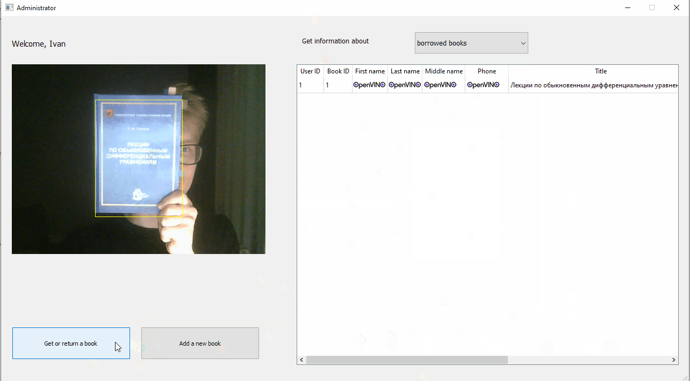
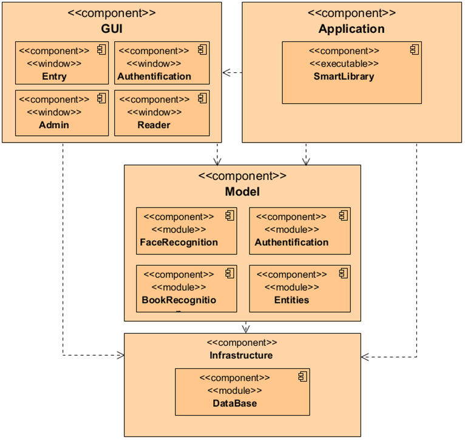
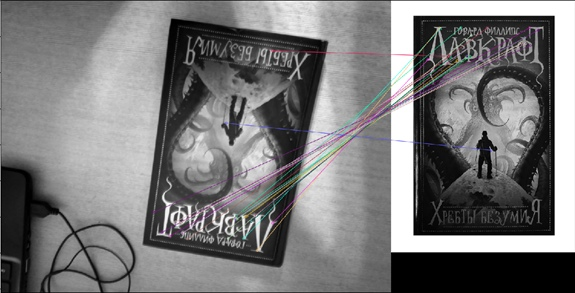

# Создание демо-приложения «Умная библиотека» с помощью Intel® Distribution of the OpenVINO™ toolkit

Кустикова Валентина, Васильев Евгений, Вихрев Иван, Дудченко Антон, 
Уткин Константин и Коробейников Алексей.

[Intel® Distribution of OpenVINO™ Toolkit](https://docs.openvinotoolkit.org/) - 
набор библиотек, средств оптимизации и информационных ресурсов для разработки 
приложений, использующих машинное зрение и Deep Learning. 
А эта статья расскажет, как создавалось демо-приложение «Умная библиотека» на 
основе библиотеки OpenVINO силами студентами младших курсов. 
Мы считаем, что данная статья будет интересна начинающим свой путь в 
программировании и использовании глубоких нейронных сетей.

## Введение

Глубокие нейронные сети все чаще встречаются в нашей жизни: умные колонки, 
умные камеры, умные автомобили делают нашу жизнь приятнее и комфортнее 
(по крайней мере, все так говорят). 
Однако внедрение курсов по глубокому обучению в образовательные программы 
государственных вузов проходит очень неторопливо, и обучение данным вещам 
происходит за рамками стандартной учебной программы.

[ITlab](http://www.itlab.unn.ru/) – учебно-исследовательская лаборатория 
Нижегородского университета им. Н.И. Лобачевского, созданная при поддержке 
компаний Intel и Microsoft. 
Выдающиеся студенты обучаясь начиная со 2 курса под руководством преподавателей 
выполняют серьезные и интересные проекты.
Создание высокопроизводительного программного обеспечения требует применения 
специальных инструментов разработчика и технологий параллельного исполнения 
кода, и в рамках проектов лаборатории студенты с этим знакомятся.

Относительно молодой и активно развивающийся проект – Intel® Distribution of 
OpenVINO™ Toolkit. 
Данный фреймворк нацелен на создание приложений компьютерного зрения и 
оптимизированный вывод глубоких нейронных сетей. 
Он включает в себя Inference Engine – движок запуска глубоких нейронных сетей, 
библиотеку «классического» компьютерного зрения OpenCV, и еще несколько 
необходимых компонентов.

В OpenVINO огромная библиотека семплов и демо-приложений, решающих различные 
задачи компьютерного зрения – от простой классификации или детектирования 
изображений до [быстрой сегментации дорожных сцен](https://docs.openvinotoolkit.org/2019_R3.1/_models_intel_road_segmentation_adas_0001_description_road_segmentation_adas_0001.html) 
и «[умного класса](http://docs.openvinotoolkit.org/2019_R3.1/_demos_smart_classroom_demo_README.html)», 
в котором одна нейросеть выполняет поиск лиц на видео с камеры, вторая 
идентифицирует учеников, а третья распознает их действия. 

Чтобы познакомить студентов с фреймворком OpenVINO и созданием программных 
продуктов на его основе, была отобрана мини-группа из нескольких студентов и 
под руководством преподавателей из ИИТММ ННГУ, которые  они создали новое 
демо-приложение для расширения библиотеки семплов – «Умная библиотека».

## Умная библиотека

Принцип работы приложения «Умная библиотека» следующий: пользователь 
авторизуется при помощи распознавания лица с веб-камеры, затем показывает 
камере книгу обложкой и тем самым записывает ее на себя или сдает обратно в библиотеку.
Также в системе предусмотрен администратор, который может добавлять книги в библиотеку.
Данная идея выглядела футуристично и вызвала интерес у студентов к ее реализации.

## Первая версия умной библиотеки

В первой версии библиотеки для распознавания лиц использовалась библиотека PVL 
из состава OpenVINO, а для распознавателя книг использовалось нахождение 
ключевых точек изображения и вычисление их описания на основе детектора 
[ORB](https://docs.opencv.org/4.1.2/d1/d89/tutorial_py_orb.html) из состава 
библиотеки OpenCV.

Разработку приложения было решено вести с применением паттерна DDD – и это 
очень помогло впоследствии. 

После многочисленных обсуждений была разработана следующая архитектура приложения:

Каждый модуль, решающий одну свою задачу, объявлен интерфейсом, к которому уже 
идет реализация – или несколько реализаций, тогда в программе появляется 
возможность замены модулей.

Библиотека PVL не имела Python-интерфейса, поэтому для нее пришлось написать 
обертку под Python, благо делается это несложно – нужно лишь выделить те 
функции, которые будут вызываться из Python. 
Вообще есть такой тренд, что Python библиотеки, которые требуют больших 
вычислительных затрат, пишутся на C++, для которого удобно оптимизировать и 
профилировать код, и линкуются с Python через PyBind или другие инструменты.

База данных для хранения пользователей и книг изначально реализовывалась на 
хранении информации в csv таблицах, и предполагалась реализация в PostgreSQL 
в будущем.

Для реализации распознавателя обложек книг был использован детектор и дескриптор 
ключевых точек ORB в составе OpenCV.
Данный подход хорошо находил книги, но вот с распознаванием книг дела обстояли 
несколько хуже.
Основной проблемой являлись монотонные обложки без контрастных изображений – в 
таком случае детектору просто не за что было зацепиться.  

По мотивам демо и процесса его разработки студентом 4 курса Иваном Вихревым был 
сделан доклад на конференции ГРАФИКОН 2019.

## Вторая версия умной библиотеки

К моменту окончания первой версии умной библиотеки было понятно, что у 
получившегося демо-проекта несколько недостатков.
Первый – библиотека PVL была убрана из состава OpenVINO начиная с версии 
OpenVINO 2019 R1.
Второй – распознавание книг по ключевым точкам работает не всегда. 
В это время в проект влились новые силы, и было решено сделать вторую версию 
умной библиотеки.

Для распознавания лиц вместо библиотеки PVL был применен каскад из глубоких 
нейронных сетей из состава  OpenVINO.
Первая нейронная сеть быстро находит прямоугольник лица. Вторая находит 5 
ключевых точек на лице (глаза, нос, края губ) для того, чтобы произвести 
афинные преобразования над лицом для его выравнивания.
Третья вычисляет многомерный вектор-описатель для выровненного лица пользователя.
Поиск лица в базе – это сравнение полученного вектора с векторами из базы.

Распознавание книги компьютером по изображению обложки без специальных меток 
было бы очень наглядным, но из-за неустойчивой работы алгоритма было принято 
решение использовать распознавание QR–кодов.
Данный вариант уже не выглядит таким «захватывающим», однако позволяет 
производить распознавание с высокой точностью, и к тому же увеличивает 
количество потенциальных применений данного демо в различных областях.

Пулл-реквест в репозиторий семплов [Open Model Zoo](https://github.com/opencv/open_model_zoo) 
сейчас проходит ревью.
Также для внедрения демо в репозиторий графическая часть интерфейса на PyQt 
была заменена на взаимодействие через консоль и OpenCV GUI.

## Заключение

Во время работы над проектом умной библиотеки студенты познакомились с 
фреймворком OpenVINO, технологией  разработки архитектуры ПО, приобрели навыки 
совместной работы и внесли свой первый вклад в развитие Open Source движения.
Спасибо студентам ИИТММ ННГУ Вихреву Ивану, Дудченко Антону, Уткину Константину 
и Коробейникову Алексею за их активную работу над проектом.

